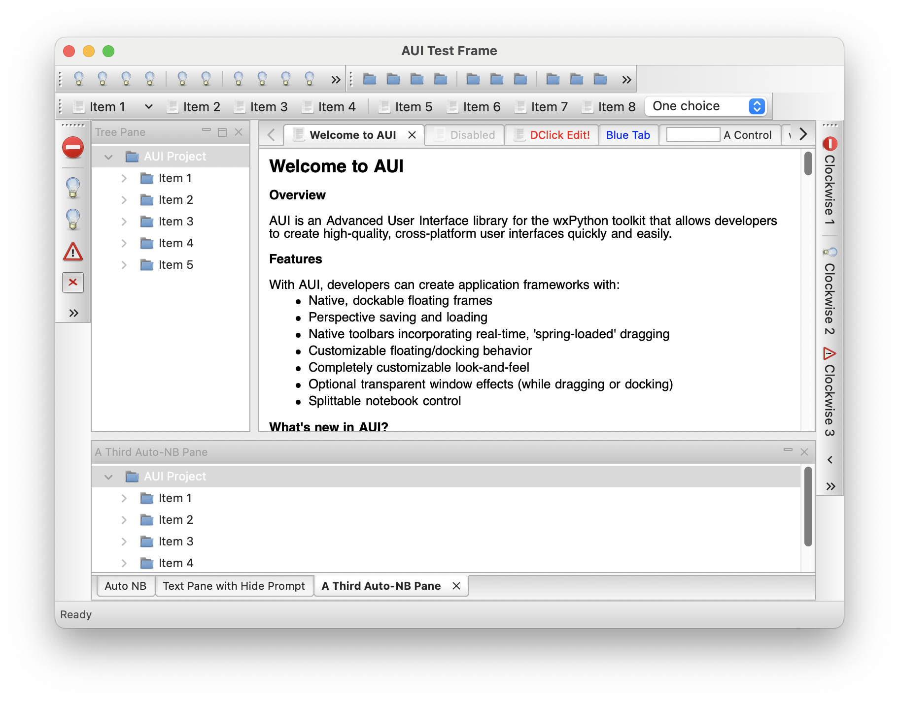
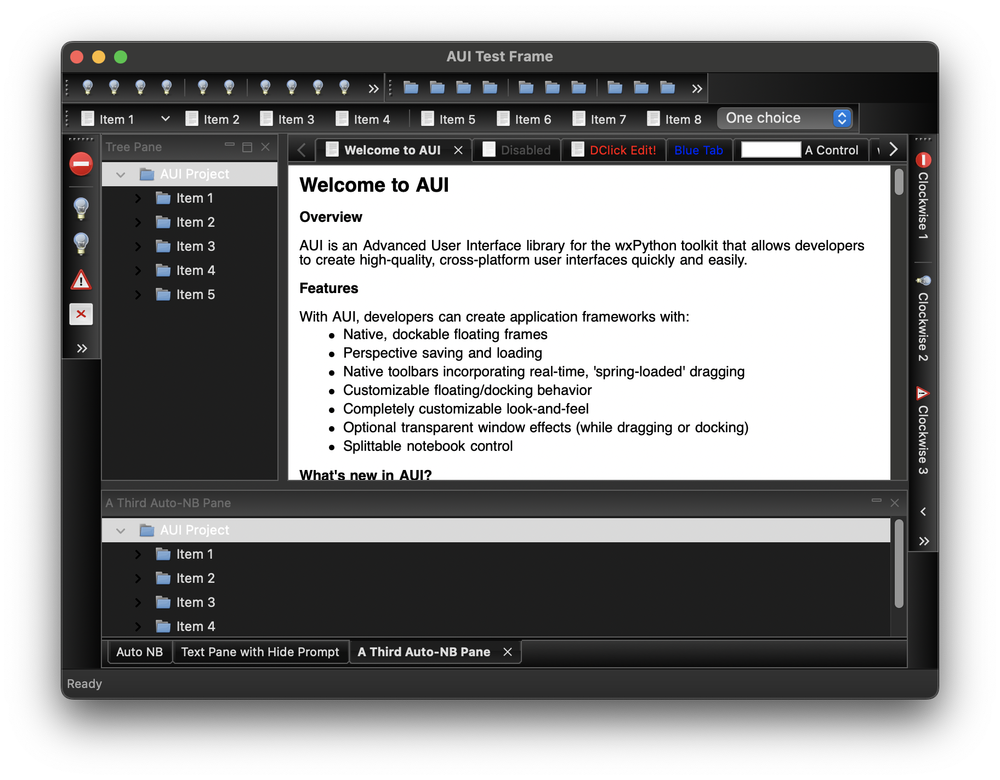

## AUI2
AUI2 is based on [wx.lib.agw.aui](https://github.com/wxWidgets/Phoenix/tree/master/wx/lib/agw/aui), with some bug fixes and improvements
1. fix [issue 2348](https://github.com/wxWidgets/Phoenix/issues/2348)
2. fix [issue 2356](https://github.com/wxWidgets/Phoenix/issues/2356)
3. fix [issue 2359](https://github.com/wxWidgets/Phoenix/issues/2359)
4. fix [issue 2361](https://github.com/wxWidgets/Phoenix/issues/2361)
5. fix [issue 2362](https://github.com/wxWidgets/Phoenix/issues/2362)
6. fix [issue 2364](https://github.com/wxWidgets/Phoenix/issues/2364)
7. improve dark mode
    1. not work for notebook chrome theme and docking guide, as they are bitmap based.
    2. not work on [windows](https://github.com/wxWidgets/wxWidgets/pull/23028)
8. [issue 2374](https://github.com/wxWidgets/Phoenix/issues/2374)
9. integrate with [auibarpopup](https://github.com/tianzhuqiao/auibarpopup)

### Usage
1. Install
```bash
$ pip install aui2
```

2. Import **aui2**
```python
import aui2 as aui
```
### Screenshots
</img>
</img>
